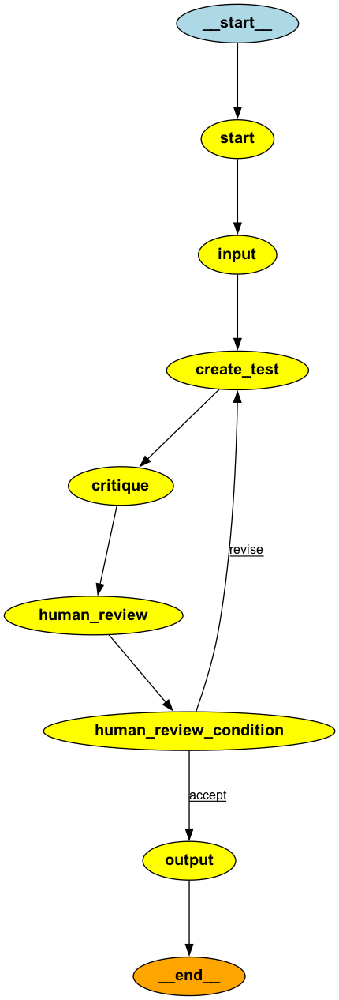

# teacher-agent
Working app to demonstrate multi-agent and Human-In-the-Loop collaboration to perform a task.
In this specific case, the task is to create an AI teacher agent to generate a set of questions to test the student on a given lesson. However, the same logic can be extended to build other multi-agent human collaboration tasks.

The app uses langgraph to orchestrate the task. [langgraph](https://github.com/langchain-ai/langgraph)is a library for building stateful, multi-agent applications with LLMs, built on top of LangChain.

## overview

teach_agent.py contains the main logic and all of the langchain related code for the application. 

teach_st.py is the main program of the streamlit version and contains all the streamlit specific logic

InputAgent - Agent to read lesson text from the file.

TeacherAgent - Agent to generate test questions from AI for a given lesson.

CritiqueAgent - Reflection Agent to generate a critique to generated questions for the lesson.

HumanReviewAgent - Agent to receive Human feedback/critique.

Below diagram shows the work flow for the demo app.
 

The flow is started with the dummy StartAgent. Start node is connected to the input node that has the sole responsibility of reading the lesson text. The lesson is added to the state which is passed on to the next connected node. The node is create_test which invokes set_test function of TeacherAgent to generate test questions from LLM. Next is the crtique node which invokes crtique function of CritiqueAgent to generate critiques for the generated test questions. At this stage, the graph state stores LLM generated questions and crtique in addition to the input lesson. 

Next in the flow is human-in-the-loop input. This is represented by the connected node human_review which is responsible for receiving user input for revising the AI generated test questions. User has an option to edit AI generated critique, enter own critique or provide no critique. HumanReviewAgent is responsible for updating the state to indicate whether user wants to provide critique or not. Conditional edges allow branching logic for the flow. If the critique was provided, the flow is redirected to create_test node to repeat the process to revise test questions. If no critique was provided and user accepts the generated questions, the flow will be directed to OutputAgent which simply prints output and the flow completes.    

Click [https://teacher-agent.streamlit.app/](https://teacher-agent.streamlit.app/) to use the app. You will need an OPENAI api key to use the app.

The code is based on the meeting-reporter repo available here: https://github.com/tevslin/meeting-reporter/
 
